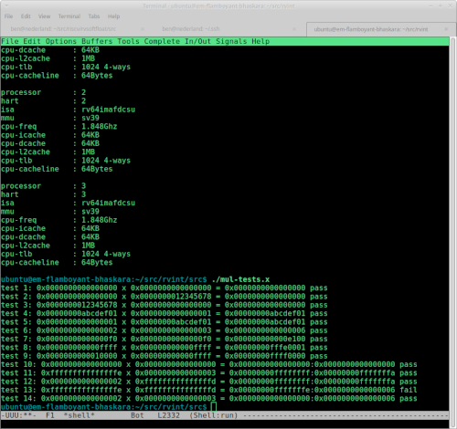

# rvint

Integer-based mathematical subroutines which implement RISC-V M and B
extension functionality on I, and Zmmul instruction sets. If there is
interest, I could support other instruction sets such as E.

## Division

### On 32-bit processors
- 32-bit by 32-bit signed and unsigned division with 32-bit result and remainder.
### On 64-bit processors
- 64-bit by 64-bit signed and unsigned division with 64-bit result and remainder.

## Multiplication

### On 32-bit processors:
- 32-bit by 32-bit signed and unsigned multiplication with 32-bit result.
- 32-bit by 32-bit signed and unsigned multiplication with 64-bit result. - not complete

### on 64-bit processors:
- 32-bit by 32-bit signed and unsigned multiplication with 64-bit result.
- 64-bit by 64-bit signed and unsigned multiplication with 64-bit result.
- 64-bit by 64-bit signed and unsigned multiplication with 128-bit result. - not complete

## Base Conversions & I/O Operations

These operations support 32-bit numbers on 32-bit architectures and
64-bit numbers on 64-bit architectures.

- ASCII binary to binary.
- ASCII unsigned decimal to binary.
- ASCII signed decimal to two's complement binary.
- ASCII hexadecimal to binary.
- binary to ASCII binary.
- two's complement binary to ASCII signed decimal.
- unsigned binary to unsigned ASCII decimal.
- binary to ASCII hexadecimal.

## Square Root
- 32-bit integer square root on 32-bit processors. - correct but not yet optimal
- 64-bit integer square root on 64-bit processors. - correct but not yet optimal

## Greatest Common Divisor
- 32-bit GCD of two unsigned 32-bit numbers on 32-bit processors.
- 64-bit GCD of two unsigned 64-bit numbers on 64-bit processors.

## Least Common Multiple
- 32-bit LCM of two unsigned 32-bit numbers on 32-bit processors.
- 64-bit LCM of two unsigned 64-bit numbers on 64-bit processors.

## Bit Operations
- Count leading zeroes in 32-bit number on 32-bit processors.
- Count leading zeroes in 64-bit number on 64-bit processors.
- Count trailing zeroes in 32-bit number on 32-bit processors.
- Count trailing zeroes in 64-bit number on 64-bit processors.

## Building

clang, lld, and make are assumed. I'm currently using clang 18.
The TARGET, ARCH, and ABI should be edited in the Makefile,
and the CPU_BITS constant should be set to match in config.s

The test programs assume Linux syscalls are available. In particular
syscall 64 is write and 93 is exit.

I use this emulator to run RV32I code:
https://riscv-programming.org/ale/
I'm running RV64 code on a scaleway elastic metal cloud instance:
https://labs.scaleway.com/en/em-rv1/

